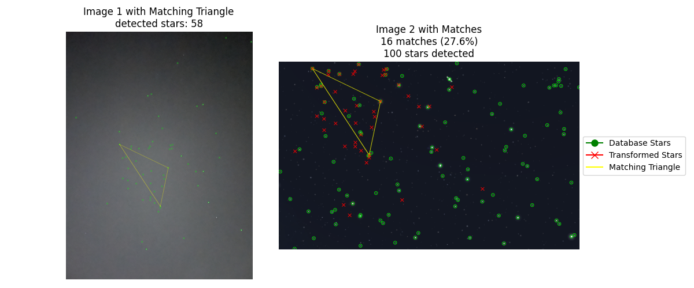
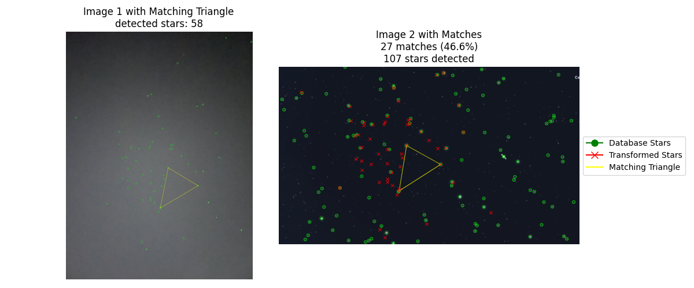
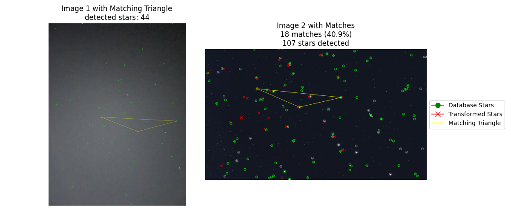
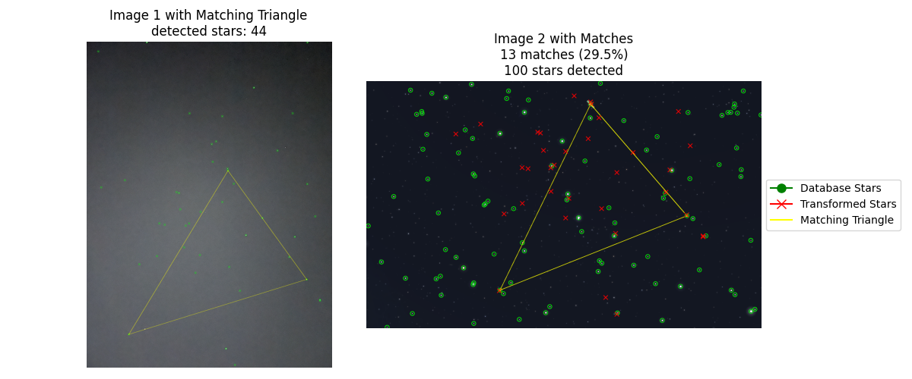
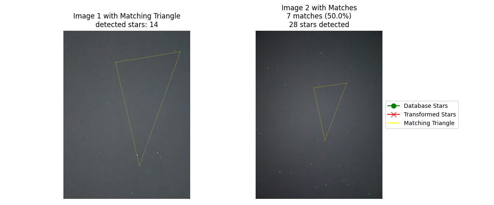
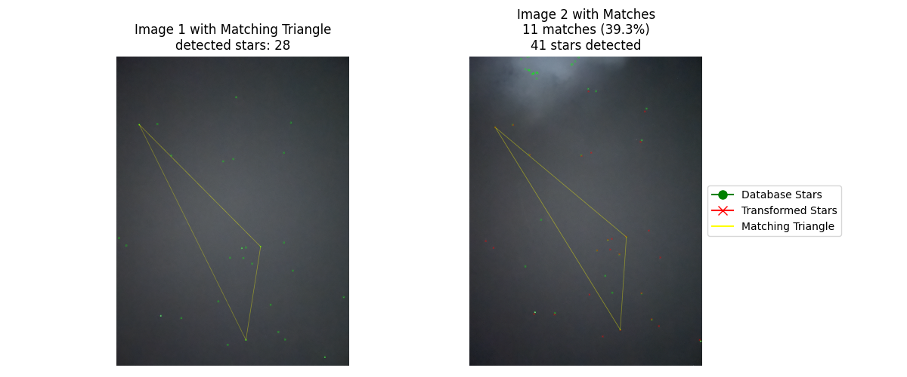
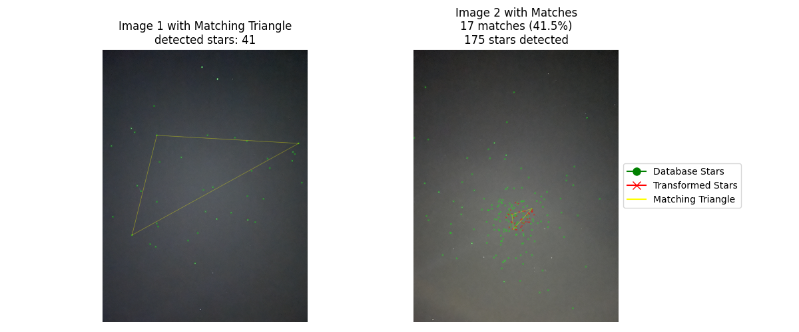

# Star Pattern Recognition Algorithm

This project implements a star pattern recognition algorithm that can match stars between two images using triangle pattern matching. The algorithm consists of three main parts:

## Part 1: Star Detection Algorithm

The algorithm uses computer vision techniques to detect stars in both images. The process involves:

- Converting images to grayscale
- Applying binary thresholding to separate bright spots (stars) from the background
- Using contour detection to identify star shapes
- Filtering stars based on area and circularity
- Computing centroids of detected stars

The implementation allows for adjusting parameters like brightness threshold (127 by default) and star size filters (5-2000 pixels area range) to optimize detection for different images.

## Part 2: Triangle Pattern Matching

The algorithm uses a geometric approach to match star patterns:

- Creates triangles from detected stars in both images
- For each triangle, computes its signature based on:
  - Side length ratios (normalized by the longest side)
  - Internal angles
- Builds a hash table (database) of triangle signatures from the reference image for efficient matching
- Uses this hash table to quickly find corresponding triangles between images by looking up similar signatures
- When a matching triangle is found, it computes the transformation matrix that maps x,y coordinates from one image to another

The use of a hash table significantly improves the matching efficiency by allowing O(1) lookup of similar triangle patterns instead of comparing every possible triangle combination between the two images.

## Part 3: Transformation Validation

The final part validates and refines the matches:

- Takes the candidate triangle matches
- Computes an affine transformation between the matched triangles
- Applies this transformation to all stars from the first image
- Calculates how many transformed stars align with stars in the second image
- Selects the transformation that yields the highest number of matching stars
- Uses a distance threshold to determine if transformed stars match reference stars

## Usage

The code requires Python with the following dependencies:

- OpenCV (cv2)
- NumPy
- SciPy
- Matplotlib

To run the star matching algorithm:

```python
python main.py
```

The program will:

1. Load and process two star images
2. Detect stars in both images
3. Find matching patterns
4. Display a visualization showing:
   - Detected stars in both images
   - The matching triangle pattern
   - Lines connecting matched stars
   - Match statistics

## Parameters

Key parameters that can be adjusted:

Star Detection (`StarDetector` class):

- `threshold`: Brightness threshold (default: 127)
- `min_area`: Minimum star size (default: 5 pixels)
- `max_area`: Maximum star size (default: 2000 pixels)

Triangle Matching (`TriangleMatcher` class):

- `tolerance`: Tolerance for side length ratio matching (default: 0.05)
- `angle_tolerance`: Tolerance for angle matching in degrees (default: 2.0)
- `match_distance`: Maximum distance for point matching after transform (default: 20.0)
- `min_match_count`: Minimum number of stars that must match (default: 5)
- `max_tries`: Maximum number of random triangles to try (default: 100)

## Results

Below are different examples showing the star pattern recognition algorithm applied to various star field images:

- _Examples with different images:_

  

  

  

  

  

- _Examples: Star recognition with different viewing angles and scales:_
  

  

  
